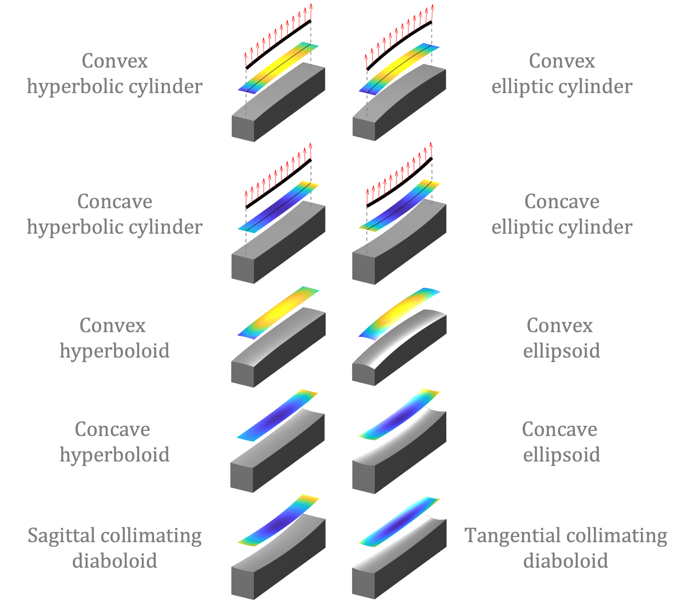

# XMF

Welcome to the X-ray Mirror surface shape Fitting (XMF)!

<p align="center">
    
</p>

In the [XMF documentation (https://nsls2omf.github.io/xmf)](https://nsls2omf.github.io/xmf/), we introduce the modules and functionalities of XMF in Python and MATLAB.

# Framework

XMF is a framework for the X-ray mirror surface shape fitting, particularly in the context of convex and concave shapes.

<p align="center">
   
</p>

It provides data analysis and visualization tools for fitting measurement data to various geometric shapes, including elliptic cylinders, hyperbolic cylinders, ellipsoids, and hyperboloids.

<p align="center">
   
</p>

The framework is composed of four main layers:

- **Layer 1: Standard shape from expressions**. It contains the standard mathematical expressions of various off-axis mirror shapes.
- **Layer 2: Surface generation**. It generates surface shapes in height or slope, by taking into account the rotation and translation of the shapes.
- **Layer 3: Optimization**. It optimizes the user-selected fitting parameters.
- **Layer 4: Function wrapper**. It offers convenient functions to fit measurement data for specific shapes.

# Example codes

Python example for fitting a concave ellipse slope:

```python
import xmf

target_params_dict = {
   'p': p,
   'q': q,
   'theta': theta,
   'x_i': x_i,
   'beta': beta,
}

params_input_dict = {
   'p': p,
   'q': q,
   'theta': theta
}

opt_dict = {
   'p': False,
   'q': False,
   'theta': False
}

sx1d_res, sx1d_fit, opt_params_dict, opt_params_ci_dict, _ = xmf.fit_concave_ellipse_slope(x1d, sx1d_measured, params_input_dict, opt_dict)
xmf.fig_show_1d_fitting_slope(x1d, sx1d_measured, sx1d_fit, sx1d_res, target_params_dict, opt_params_dict, opt_params_ci_dict, 'Concave Ellipse Slope')
```

MATLAB example for fitting a concave ellipse slope:

```matlab
input_params_struct.p = p;
input_params_struct.q = q;
input_params_struct.theta = theta;

opt_struct.p = false;
opt_struct.q = false;
opt_struct.theta = false;

[sx1d_res, sx1d_fit, opt_params_struct, opt_params_ci_struct] = fit_concave_ellipse_slope(x1d, sx1d_measured, input_params_struct, opt_struct);
fig_show_1d_fitting_slope(x1d, sx1d_measured, sx1d_fit, sx1d_res, input_params_struct, opt_params_struct, opt_params_ci_struct, 'Concave Elliptic Cylinder');
```
